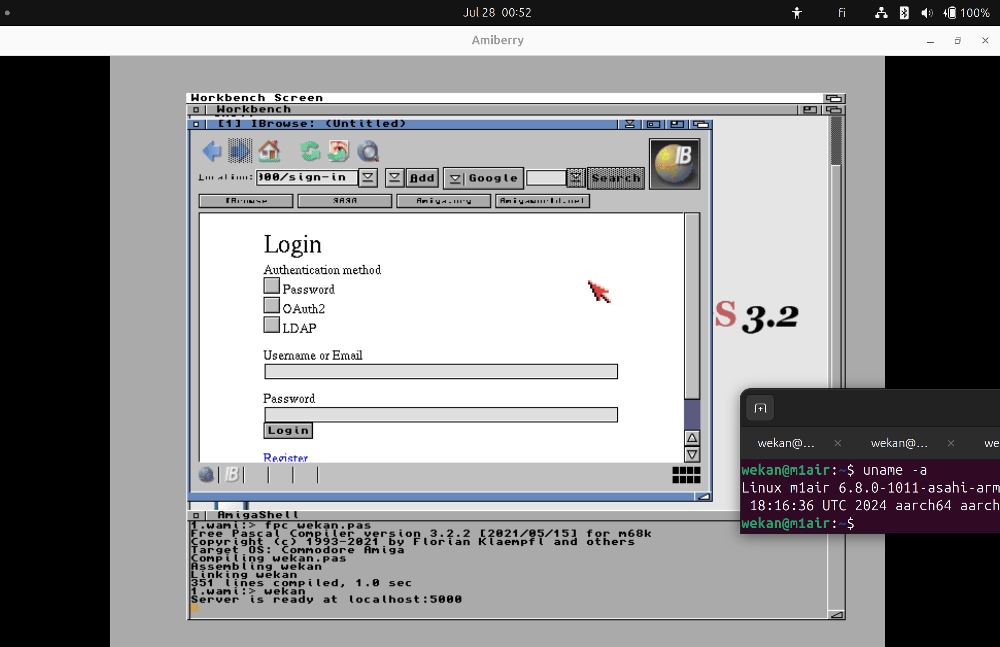

# Wami: WeKan made with FreePascal for Amiga etc

## Design

- Works at all browsers with same code
  - Modern
    - Drag multiple cards at once with touch at modern devices with https://interactjs.io
    - SVG/VML for vector drawing
  - Retro
    - HTML4 like at https://aminet.net
    - Icons with GIF images, because GIF works at all browsers
    - Rounded corners for cards and board icons with transparent corner GIF image
    - Vector drawing at all browsers, function DrawLine(), for Pi Program Board with Red (and other color) Strings https://github.com/wekan/wekan/issues/3392
      - SVG
        - Netsurf
        - Safari/Chromium/Firefox based browsers
      - VML
        - IE6
      - TODO: ASCII art
        - Amiga IBrowse
        - Elinks
        - w3m
   - Not supported browsers:
     - Why?
       - No HTML Button and submit form features. How to save form data?
       - Is there some way to get these working?
     - IE3 at Win95
     - Netscape at OS/2
- Accessibility
  - Like KDE accessibility issue
    - EU Directive 2019/882
    - https://invent.kde.org/teams/accessibility/collaboration/-/issues/30
    - https://www.youtube.com/watch?v=PM6TRj54L_8

## Screenshot

FreePascal compilers for many operating systems:
https://www.freepascal.org/download.html

Here is that wekan.pas compiled with FreePascal at
AmigaOS 3.2 680x0, using IBrowse webbrowser,
running at AmiBerry Amiga Emulator
(AmiBerry executeable originally for RasPi4),
running at M1 Air Asahi Ubuntu 24.04:



## Cloning repo

```
git clone https://github.com/wekan/wami

cd wami
```

## Compiling with FreePascal

```
fpc wekan.pas
```

## Running at Amiga

```
wekan
```

## Running at Linux

Add executeable permission:
```
chmod +x wekan
```

Run:
```
./wekan
```

## Running at Windows

```
wekan.exe
```

## Stopping

Keyboard keys `Ctrl` and `c`:

```
Ctrl-c
```

## Web framework

https://wiki.freepascal.org/fpWeb_Tutorial

## Web browsers

- Tested with all browsers, works also without Javascript:
  - Modern browsers based on: Chromium, Firefox, Safari
  - Upcoming browsers: Ladybird
  - Limited Javascript: Netsurf, Amiga IBrowse, ReactOS 32bit Wine Internet Explorer
  - Without Javascript: Lynx, ELinks, w3m w3m-img, FreeDOS Dillo
  - Legacy browsers: Netscape, IE
- If browser has Javascript support, Javascript code can use https://unpoly.com for additional effects.
- No cookies. No localstorage. Sessions stored to serverside database, based on browser properties. More info at https://github.com/wekan/wekanstudio/blob/main/docs/roadmap.md#sessions

## Backend: FreePascal/SQLite

- SSR (Server Side Rendering). Like Web 1.0, with HTML/CSS at frontend
  using HTML Forms with POST/GET. FreePascal at backend. Similar like LAMP.

## This is one of WeKan Multiverse prototypes

- WeKan Open Source kanban https://wekan.github.io https://github.com/wekan/wekan/wiki/Deep-Dive-Into-WeKan
  - Same features, with changes to use minimal amount of code
  - Same API:
    - https://wekan.github.io/api/ 
    - https://github.com/wekan/wekan/blob/main/api.py
- WeKan Multiverse prototypes https://github.com/wekan/wekan/wiki/WeKan-Multiverse-Roadmap
- Database structure is same as in WeKan Open Source kanban https://wekan.github.io https://github.com/wekan/wekan (also features will be same and more),
  when exported to SQLite with https://github.com/wekan/minio-metadata

Native apps will be added for many CPU/OS. They will use same WeKan APIs, and native hardware features.
